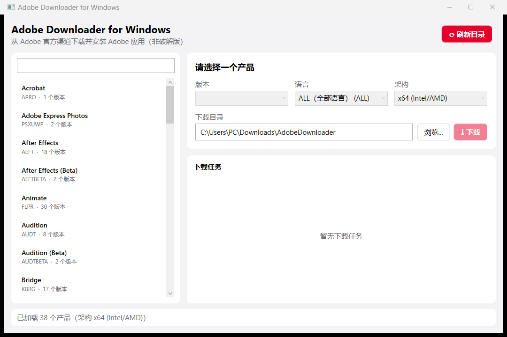

# Adobe Downloader for Windows

从 Adobe 官方渠道下载并安装 Adobe 应用的 Windows 工具。macOS 版 [X1a0He/Adobe-Downloader](https://github.com/X1a0He/Adobe-Downloader) 的 Windows 移植版。

> Adobe Downloader 中的所有 Adobe 应用均来自 Adobe 官方渠道，非破解版。



## 特性

- ✅ 从 Adobe 官方目录获取全部 Windows 桌面产品（x64 / ARM64），版本号显示为大众熟知的年份（如 `2026 (30.6)`）
- ✅ 选择产品、版本、安装语言、目标架构；产品列表带官方图标
- ✅ 并发下载、断点续传、进度显示、下载后大小校验
- ✅ 下载任务持久化：重启软件后自动恢复、可继续，直到手动删除
- ✅ 产品目录与图标本地缓存：启动即用，无需每次联网刷新
- ✅ **内置安装引擎**：自行解压 LZMA2 包、部署文件、写注册表、设权限、建快捷方式、装 VC++ 运行库，**不依赖 Adobe 官方 Setup.exe / Creative Cloud**（移植自原版 HDPIM）
- ✅ **卸载功能 🗑**：扫描注册表卸载项 + 磁盘上的 Adobe 产品目录，按版本单独卸载；对失效/残留项提供带安全校验的「强制删除」
- ✅ **清理功能 🧹**：一键扫描并清除 Adobe 残留（应用/CC/偏好/缓存/许可/日志/服务/凭据/正版验证服务/hosts），带安全护栏与扫描预览
- ✅ 统一的界面风格、单实例运行

## 与 macOS 版的关系

macOS 版自行实现了 Adobe HyperDrive 安装器（HDPIM，约 80 个文件，含 LZMA2 解压、bspatch、特权 Helper 等）。
本 Windows 版**同样自实现了安装引擎**（用 C# / .NET 移植 HDPIM 的核心：pimx 清单解析、LZMA2 解压、文件部署、注册表/权限/快捷方式、`RunProgram` 装 VC 运行库），
因此**下载与安装均不依赖 Adobe 官方组件**。字节级增量更新（原版 3.1.0 的 delta/bspatch）暂未移植。

> 许可激活（试用/登录）不在本工具范围内，由用户自行处理。

## 环境要求

- Windows 10 / 11（x64 或 ARM64）
- 运行时需 [.NET 10 桌面运行时](https://dotnet.microsoft.com/download/dotnet/10.0)（或使用自包含发布版，无需另装）
- 安装/卸载/清理需管理员权限（程序会按需申请 UAC）

## 构建与运行

```bash
# 构建
dotnet build AdobeDownloader.slnx -c Release

# 运行
dotnet run --project src/AdobeDownloader.App -c Release

# 运行测试
dotnet test tests/AdobeDownloader.Core.Tests
```

### 发布为单文件 exe（自包含，无需另装 .NET 运行时）

```bash
dotnet publish src/AdobeDownloader.App/AdobeDownloader.App.csproj -c Release -r win-x64 \
  --self-contained true \
  -p:PublishSingleFile=true \
  -p:IncludeNativeLibrariesForSelfExtract=true \
  -p:EnableCompressionInSingleFile=true \
  -o publish
```

生成 `publish/AdobeDownloader.App.exe`（内含 .NET 运行时 + WPF，双击即可运行）。
ARM64 设备将 `-r win-x64` 换成 `-r win-arm64`。

## 使用方法

1. 点击右上角 **刷新目录**，从 Adobe 获取产品列表（之后启动会读本地缓存）。
2. 在左侧选择产品，在右侧选择 **版本 / 语言 / 架构**。
3. 设置 **下载目录**，点击 **下载**。
4. 下载完成后点击任务卡片上的 **安装**，将以管理员身份用内置引擎安装（部署文件、写注册表、建快捷方式、装 VC 运行库）。
5. 卸载：右上角 **🗑 卸载** → 选择产品 → **卸载**（或对失效/残留项用 **强制删除**）。

## 清理功能 🧹

点击主界面右上角「🧹 清理」，勾选要清理的类别，先「扫描」预览将删除的内容（文件路径、注册表项、服务、hosts 条目），确认后「开始清理」（需管理员权限）。

清理带**安全护栏**：只会删除确属 Adobe 的路径，绝不触碰盘根、系统目录、Adobe 安装根或本工具自身；hosts 只移除屏蔽 Adobe 的行。⚠️ 清理不可撤销，请先看清扫描预览再执行。

## 项目结构

```
src/AdobeDownloader.Core   核心库：Adobe API 客户端、目录/包解析、下载引擎、driver.xml 生成、安装清单解析
src/AdobeDownloader.App    WPF 图形界面（MVVM）+ 安装/卸载/清理引擎
tests/                     核心库单元测试
docs/DESIGN.md             设计文档（含 Adobe 下载协议梳理）
```

## 许可证

本项目基于 [X1a0He/Adobe-Downloader](https://github.com/X1a0He/Adobe-Downloader)（GPLv3）移植，遵循 **GPLv3**，见 [LICENSE](LICENSE)。

## 免责声明

本工具仅用于从 Adobe 官方渠道下载官方安装包，请遵守 Adobe 的许可协议。软件许可激活由用户自行解决，本工具不提供任何破解或绕过许可的功能。
